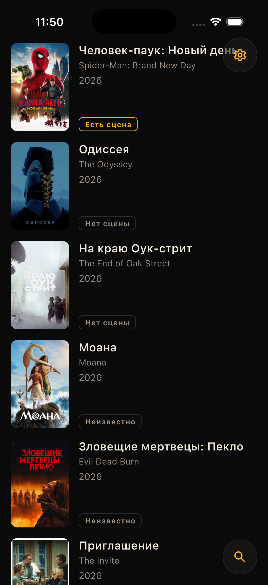
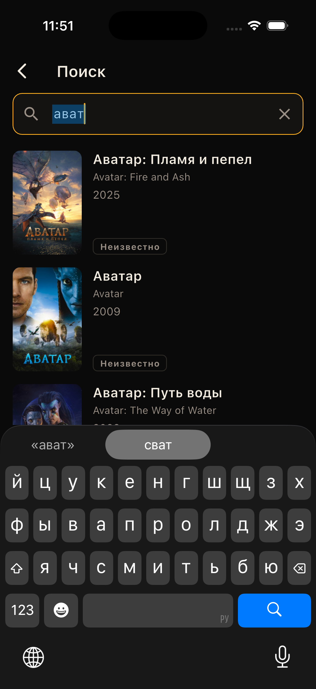
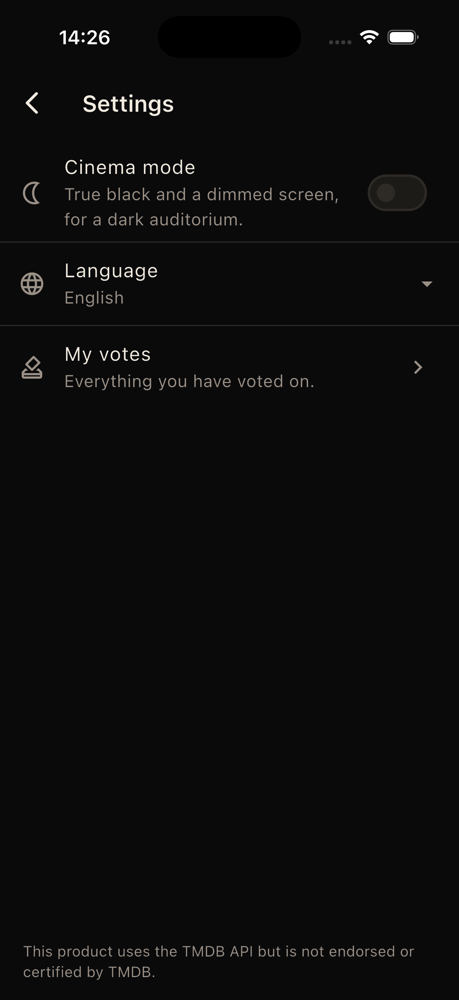
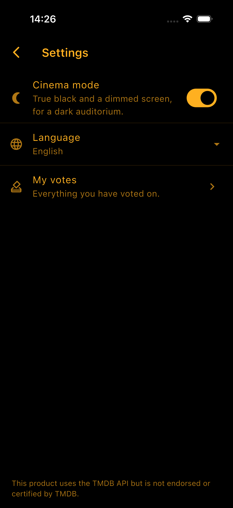

# Stingers

**Does this film have a scene during or after the credits, and is it worth waiting for?**

The credits start rolling and you have to decide whether to stay in your seat.
The app answers in two lines and says how sure it is:

```
There is a scene
86% of voters agree

Worth waiting for
64% of those who saw it
```

Nobody publishes this data — not TMDb, not anyone. The only source is the audience, so
the app collects it. Film metadata is borrowed from TMDb; the verdicts are its own.

Flutter · Supabase (Postgres + Edge Functions) · Drift · go_router
iOS · Android · macOS · Windows · Linux · Web

## Screenshots

| List | Movie with stinger | Movie without stinger |
|---|---|---|
|  |  |  |

| Search | Settings | Settings with cinema mode on |
|---|---|---|
|  |  |  |

---

## Three decisions that shaped everything

**Two independent sources, sewn together in one place.** Film metadata comes from TMDb,
verdicts come from our own Postgres. Neither knows the other exists; `MovieRepository`
joins them. This is the case the repository layer actually exists for — and it is why a
vote-service outage costs the badges, not the feed.

**The accumulated dataset is the only real asset.** So resistance to vote-stuffing is a
product requirement, not paranoia — and its governing idea is that a suspicious vote is
never rejected, only made weightless. A rejection tells an attacker their script is
wrong; `200 OK` with zero weight tells them nothing, and debugging something that never
answers costs an order of magnitude more.

**The screen is a light source pointed at strangers.** There is no light theme and there
will not be one. Emitted light is cut with the two levers that actually work — a true
black background so OLED pixels switch off, and the platform backlight API — while
on-screen contrast stays above 4.5:1. The accent is amber, because dark-adapted vision
runs on rods that peak near 500 nm: blue-white is both the most disruptive to the viewer
and the most visible to the row behind. It is the same reason aviation and astronomy
light their instruments red.

---

## Architecture

```
Flutter
  View → Controller (ChangeNotifier) → MovieRepository
                        ┌──────────────┼───────────────┐
                        ▼              ▼               ▼
                   LocalStore     TmdbService    SceneVoteService
                    (Drift)                             │
                 READ SOURCE            │               │
                  OF TRUTH              ▼               ▼
                        │        Edge Function    Edge Function
                   streams to UI      `tmdb`        `vote`
                                        │        (+ /challenge)
                                        ▼               ▼
                              api.themoviedb.org     Postgres
                            (token in function        votes / movies /
                             secrets only)         devices / stats view
```

Four rules hold everywhere, and they are the ones worth defending:

- **The UI never talks to the network.** The single most common rot in a mobile codebase
  is wiring a state object straight to HTTP. Here that is structurally impossible: a
  controller only knows a repository interface, and only the three services know that an
  outside world exists at all.
- **Reads come from Drift, never straight from the network.** Every screen subscribes to
  a database stream; a refresh writes to the database and the stream repaints. "No
  connection" becomes a quieter screen with a staleness banner, not an error screen.
- **The client never writes to `votes`.** There is no INSERT policy on any table — by
  design. The `vote` Edge Function under `service_role` is the only writer, which is what
  makes any server-side control possible at all.
- **A service wraps exactly one external system.** There are three because there are
  three systems. Composition happens in the repository, where a secondary failure can
  degrade instead of propagating.

```
lib/
  core/       config · db (Drift) · di · errors · integrity · l10n · motion
              network · router · session · theme · widgets
  features/
    movies/   data/   models · three services · repository · vote delivery queue
              state/  four controllers, one per screen
              view/   feed, details, search, my votes + shared widgets
    settings/ cinema mode, language, "my votes" entry, TMDb attribution
supabase/
  migrations/ schema, the trust-weighted stats view, RLS, the vote-path functions
  functions/  tmdb (read proxy) · vote (the only write path)
```

There is no tab bar. The feed is the only root screen; search and settings are two small
glass buttons floating over it, and everything else is pushed on top. A tab bar here would
have spent a third of the bottom of the screen advertising two destinations one tap already
reaches.

## Engineering worth a closer look

**Optimistic voting that is a real row, not a UI illusion.** A vote is written to the
local database *before* the network is consulted. That one row is simultaneously the
optimistic update (the UI reads the database, so the percentage moves on tap), the
offline queue, and the thing that survives a restart. A server rejection rolls back both
the vote and the aggregate — in the database, because the controller does not own the
rows the UI reads.

**An offline queue that needs no protocol.** A vote is upserted server-side on
(film, device), so it is idempotent by nature: no idempotency keys, no server
cooperation, re-sending is free. One device owns the row and is its only writer, so
conflicts cannot happen and there is no merge policy to design. The queue flushes on the
next successful request and on app resume — deliberately not gated on `connectivity_plus`,
which reports a link, not the internet.

**Trust-weighted aggregation.** The public view sums weights, never counts rows, so a
farmed vote is stored and simply weighs nothing. A verdict appears only above a minimum
*weight*, which means ten weightless votes produce no verdict at all. The gap between
`raw_votes` and `total_weight` is the audit signal that someone is at work. A vote's
weight is frozen onto the row the moment it is cast, not read live off the device, so a
device that misbehaves once does not retroactively devalue every vote it ever cast — and
changing your mind about an answer you already gave keeps the original weight rather
than being re-judged, which also closes the obvious game of re-voting until the number
comes out favourable.

**Three Postgres functions instead of ten round trips.** Casting a vote touches a rate
limit, a nonce, a film lookup, a weight, and three tables — that used to be one
PostgREST call per step. `vote_issue_challenge` mints the nonce; `vote_prepare` gathers
everything the decision needs in one read; `vote_finalize` spends the nonce and writes
the vote, the audit row and the device's standing in a single transaction. The
prepare/finalize split exists for one reason: whether to spend the nonce depends on a
rate-limit decision made with `vote_prepare`'s numbers, and a nonce guarding a request
that gets rejected must not be burned. The old shape had a real gap here — a crash
between "nonce consumed" and "vote stored" lost the vote and burned the nonce with
nothing to show for it; one transaction closes that. An amendment (the device already
has a vote on this film) is logged separately from a new vote in the audit trail, so
changing your mind a few times does not eat the same hourly quota meant to catch a
device voting on many different films fast.

**Layered resistance to vote-stuffing.** The client is treated as a hostile environment
throughout — it holds a public key, its strings are readable, and its traffic is
interceptable, so nothing it reports about itself is believed. Layers, from cheap to
expensive: no write path on the client · per-device and per-IP rate limits inside the
vote path · single-use nonces bound to (device, film, 5 min) · device attestation verified
in the function (seam in place; enabling it needs store credentials) · identity that
survives a reinstall, Keychain on iOS and `ANDROID_ID` on Android · trust weighting · an
audit trail of every attempt.

Sign-up friction is deliberately not on that list. `votes` is keyed on `(film, device)`
and the device id arrives in the request body, so a million accounts behind one device
still cast one vote and an attacker never needs a second account at all. A CAPTCHA on
anonymous sign-in would defend the auth table and the invoice while leaving the dataset
exactly as exposed.

**A theme with a test that enforces it.** `app_theme_test.dart` walks every
`ColorScheme` role and fails on anything blue-dominant, on pure white, on a component
theme hiding a light surface, and on contrast below 4.5:1. It has already caught a real
regression — two "neutral" greys that were a step blue. This is what stops blue-white
from creeping back in six months through a role nobody looked at.

**Nothing may flash white.** Audited end to end: the iOS launch storyboard and
`UIUserInterfaceStyle`, the Android launch theme in *both* light and night resource sets,
the macOS window background and appearance, `index.html` and the PWA manifest on web,
image placeholders, and M3's snackbar default — which is a light slab in a dark theme
until you override it.

**Errors as a closed set.** A sealed `AppException` hierarchy, parsed with an explicit
unknown-falls-through arm so a server that grows a new error type can never make an old
client throw while handling an error. Failures are routed by blast radius: a full-screen
retry, a snackbar, or — when the cache has content — nothing but a staleness banner.

**Controllers that survive their own async work outliving the screen.** Tapping a vote
and immediately backing out of the details page disposes the `ChangeNotifier` while its
network call is still in flight; the completion still runs and, unguarded, calls
`notifyListeners()` on a disposed object. Every controller with a pending future checks a
disposed flag before it notifies — caught by a test that fires a vote and disposes the
controller before the fake repository's future ever resolves, not by inspection.

---

## Running it

### 1. Prerequisites

- [Flutter](https://docs.flutter.dev/get-started/install) 3.41 or newer
- A free [TMDb](https://www.themoviedb.org/settings/api) API **Read Access Token** (v4)
- A free [Supabase](https://supabase.com) project — no card required
- The [Supabase CLI](https://supabase.com/docs/guides/cli): `brew install supabase/tap/supabase`

### 2. Backend

```bash
supabase link --project-ref <your-project-ref>
supabase db push

supabase secrets set TMDB_ACCESS_TOKEN=<TMDb v4 read access token>
supabase secrets set IP_HASH_SECRET=<any long random string>

supabase functions deploy tmdb
supabase functions deploy vote
```

Then turn on anonymous sign-in: **Authentication → Providers → Anonymous** in the
Supabase dashboard.

`SUPABASE_URL` and `SUPABASE_SERVICE_ROLE_KEY` are injected into the functions by the
platform — they are not secrets you set.

### 3. App

Copy the config template and fill in the two values from **Project Settings → API**:

```bash
cp dart_defines.example.json dart_defines.json
```

```jsonc
{
  "SUPABASE_URL": "https://abcdefgh.supabase.co",
  "SUPABASE_ANON_KEY": "eyJhbGciOi…"     // the publishable / anon key
}
```

From a terminal:

```bash
flutter pub get
flutter run --dart-define-from-file=dart_defines.json
```

The only key the binary carries is the publishable one. Dart string constants survive
AOT compilation and fall out of `libapp.so` under `strings`, so the TMDb token lives in
the Edge Function's secrets and nowhere else.

A brand-new project shows "no verdict" everywhere. [`supabase/seed.sql`](supabase/seed.sql)
fills ~30 films with synthetic votes at a realistic spread of trust — open the app once
first, so the films and an anonymous user exist.

### 4. Putting the web version on a site

The web build is a folder of static files. Any static host will serve it — no server, no
Node, no Docker.

```bash
flutter build web --release --dart-define-from-file=dart_defines.json
```

Everything now lives in `build/web/`. To check it locally first:

```bash
cd build/web && python3 -m http.server 8000
# open http://localhost:8000
```

Then pick a host and upload that folder:

| Host | How |
| --- | --- |
| **Netlify** | Drag `build/web` onto [app.netlify.com/drop](https://app.netlify.com/drop). Live in seconds, gives you an HTTPS URL. |
| **Vercel** | `npx vercel deploy --prod build/web` |
| **Firebase Hosting** | `firebase init hosting` (public directory: `build/web`, single-page app: **yes**), then `firebase deploy` |
| **GitHub Pages** | Push `build/web` to a `gh-pages` branch. See the base-href note below. |
| **Any web server** | Copy `build/web` into the document root (nginx, Apache, S3 + CloudFront…). |

Two things that trip people up:

- **Serving from a subdirectory** (e.g. `example.com/stingers/`) needs the path baked in
  at build time — otherwise the page loads and stays blank:
  ```bash
  flutter build web --release --base-href=/stingers/ --dart-define-from-file=dart_defines.json
  ```
- **Deep links** (`/movie/693134`) require the host to serve `index.html` for unknown
  paths. Netlify, Vercel and Firebase call this "single-page app" mode and it is one
  checkbox. On nginx: `try_files $uri $uri/ /index.html;`

CORS needs no work — both Edge Functions already send the right headers.

Publishing the web build publishes the publishable key with it, which is what that key
is for. Everything that matters is enforced server-side: reads are constrained by RLS
and writes are impossible without going through the `vote` function.

---

## The API surface

Four calls. That is all of it.

```
GET  /functions/v1/tmdb/movie/now_playing?page=1&region=US
GET  /functions/v1/tmdb/movie/{id}
GET  /functions/v1/tmdb/search/movie?query=dune&page=1&language=ru-RU
POST /functions/v1/vote/challenge   { tmdb_id, install_id, platform }
                                 -> { nonce, expires_at }
POST /functions/v1/vote            { tmdb_id, install_id, platform, has_scene,
                                     worth_it, nonce, attestation_token,
                                     attestation_verdict }
                                 -> { tmdb_id, raw_votes, total_weight,
                                      scene_weight, worth_weight, worth_total }
```

`tmdb` passes TMDb's own envelope through unchanged, so the Dart models mirror TMDb's
field names directly. Anything outside that path allowlist is a 404, and any query
parameter outside `page | query | region | language | include_adult` is dropped — an open
proxy is an SSRF primitive and a way to spend someone else's TMDb quota.

Aggregates are read straight from PostgREST — `movie_scene_stats` for a whole page of
ids in one request, never one per row — and `votes` for the caller's own rows, narrowed
by RLS with no user id in the query.

Both functions answer failures with one envelope, `{"error_type": …, "error": …}`. The
client dispatches on `error_type` and never shows `error` to a user.

To confirm the write path really is closed, run this in the SQL editor:

```sql
set role anon;
insert into public.votes (tmdb_id, device_id, user_id, has_scene)
values (1, gen_random_uuid(), gen_random_uuid(), true);
-- expected: new row violates row-level security policy
```

---

## Tests

```bash
flutter analyze
dart format --set-exit-if-changed .
flutter test
```

All three gate "done" locally. [CI](.github/workflows/ci.yml) runs analyze and test the
same way, and folds the format check into one regenerate-format-and-diff step, which
also catches Drift or l10n output that was never regenerated. Formatting has to happen
before that diff: drift_dev formats its own output at 80 columns and ignores the
`page_width: 90` in `analysis_options.yaml` that `dart format` obeys, so comparing
straight after codegen just diffs the two widths against each other. The backend has its
own gate: `deno check`, `deno lint`, `deno fmt --check` and `deno test` inside
`supabase/functions`, wired into the same CI run.

214 Dart tests, 18 Deno tests. The ones worth reading first, because they encode
decisions rather than behaviour:

- `test/core/theme/app_theme_test.dart` — every `ColorScheme` role is warm, nothing is
  pure white, no component theme hides a light surface, contrast holds above 4.5:1.
- `test/features/movies/data/movie_repository_test.dart` — the join, the degradation when
  the vote service is down, the offline queue, and the rollback of both the vote and the
  aggregate when the server refuses.
- `test/features/movies/data/vote_delivery_test.dart` — a second answer is written
  locally without waiting for the first to land, and deliveries still go out to the
  server one at a time, in the order they were cast.
- `test/features/movies/data/movie_models_test.dart` — percentage arithmetic at zero
  weight, at the threshold, and the case that matters: ten farmed votes with no weight
  produce no verdict.
- `test/features/movies/data/local_store_test.dart` — Drift on an in-memory database:
  cache freshness, the vote queue, and that scrolling the feed cannot wipe a description
  the details screen fetched.
- `supabase/functions/_shared/trust_test.ts` — the weighting formula is a pure function
  of counts handed to it, not a database client, so every threshold is a one-line
  assertion with no fake Postgres required.

---

## What isn't done, and why

- **Device attestation is a seam, not an implementation.** `_shared/attestation.ts` fails
  safe — an unverified token can never yield `genuine`, only `unavailable` at reduced
  weight — which is why a simulator still votes. Nothing is actually verified yet: real
  verification needs an Apple team id and App Attest key, or a Play Console app and a GCP
  service account, and it is not code worth writing, or trusting, blind.
- **`movie_scene_stats` is a plain view, not materialized — deliberately, for now.**
  Every read is filtered by `tmdb_id`, so today it is an index scan over tens of films,
  not an aggregate over the whole table. It will need a materialized view once an
  unfiltered read appears or a page read crosses ~50 ms, not before.
- **`SceneVoteService` still reads PostgREST directly**, unlike every other client-server
  path, which goes through an Edge Function. Not a security gap — RLS already covers it —
  just a portability cost, paid to avoid an extra network hop and cold start for two
  read-only queries.
- **The optimistic fold hard-codes the server's weight.** `SceneStats.assumedOwnWeight`
  is `0.12` — the floor of what `trust.ts` gives a fresh device — so the percentage can
  move on tap without asking the server what the vote is worth. It is deliberately the
  floor and not the middle: the server can only correct upwards, and a client that
  over-counts its own vote shows a verdict that then disappears on the next visit. The
  copy has to be revisited by hand whenever the weighting formula changes; it holds
  because the number is a floor, not because the two stay in sync.

None of these are unknown unknowns. Each has a written trigger for when it stops being
fine to leave alone.

## Manual acceptance

The steps where apps like this usually come apart:

1. Airplane mode, cold start → feed, details and posters from cache, staleness banner on
   top. No error screen anywhere.
2. Airplane mode, vote → accepted locally and queued; restore the network and return to
   the app → it leaves by itself.
3. Vote → the percentage moves immediately, then settles on the server's answer.
4. Vote, then immediately vote the opposite answer, several times in a row → every tap
   answers within a beat, none of them rate-limited — changing your mind is free.
5. Disable the vote service → the feed loads **without badges**, not with an error.
6. In the SQL editor as `anon`: `insert into votes` → refused, no policy exists.
7. Cinema mode → background `#000`, no white anywhere, screen dims; background the app →
   brightness restored; foreground it → dimmed again.
8. Walk every screen on video → not one white frame, including the cold-start splash.
9. Switch the device to Russian → interface, film descriptions and error copy all follow,
   with no restart.

---

## Licence

Source-available, not open source. Read it, quote it, run it locally — see
[`LICENSE`](LICENSE). Publishing it to an app store, hosting it as a service, or
redistributing the source needs written permission.

This product uses the TMDB API but is not endorsed or certified by TMDB.
